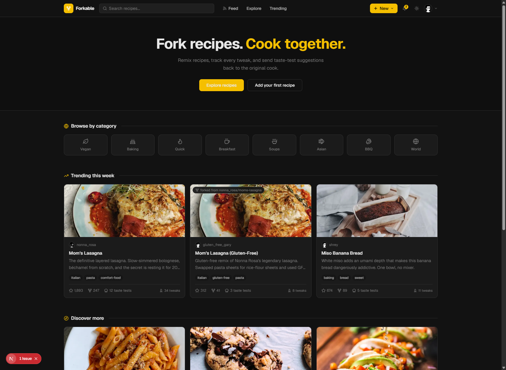
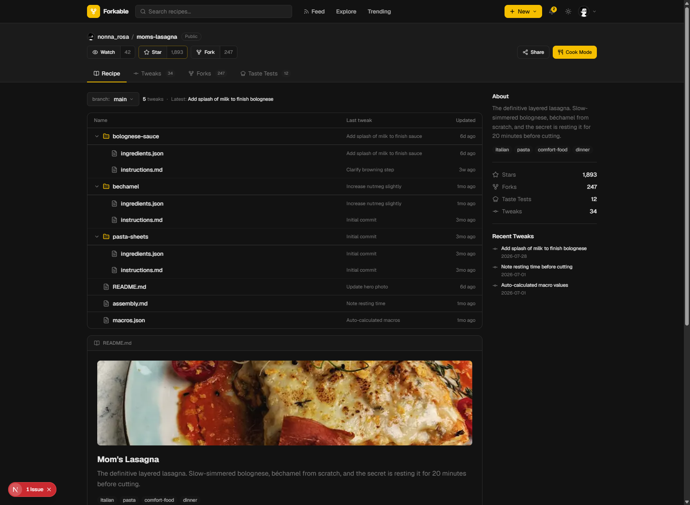
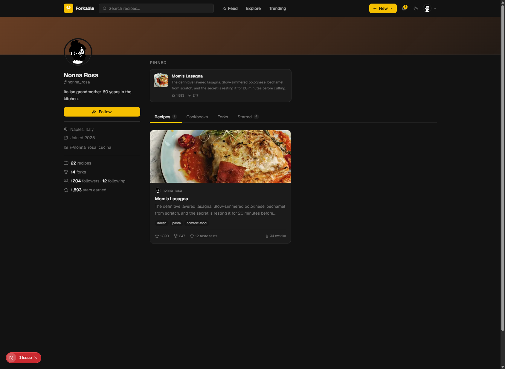
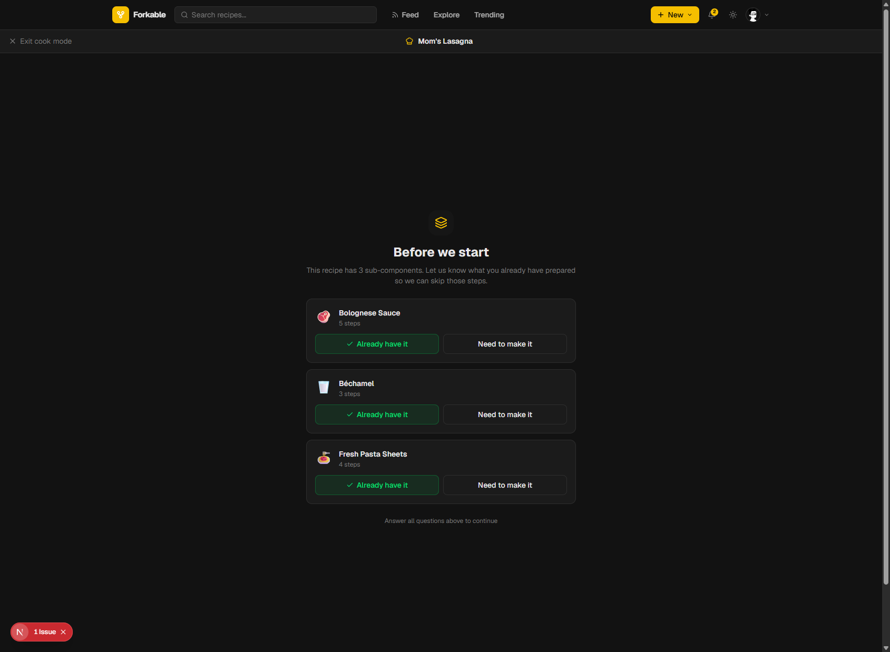

<div align="center">

# Forkable

**Version control for recipes.**

Think GitHub - but for cooks. Fork recipes, commit tweaks, diff versions, blame a step back to whoever wrote it, and open Taste Tests (pull requests) with one-click merge.

**[Live demo →](https://fforkable.vercel.app)** &nbsp;·&nbsp; see [Live Demo vs. Local Setup](#live-demo-vs-local-setup) below for what's enabled where.

[](https://github.com/shreywy/forkable/actions/workflows/ci.yml)
[](https://nextjs.org)
[](https://www.typescriptlang.org)
[](https://tailwindcss.com)
[](https://neon.tech)
[](https://prisma.io)
[](https://vitest.dev)



</div>

---

## The Concept

Every git concept maps to something in the kitchen:

| Git | Forkable |
|-----|----------|
| Repository | Recipe (`shrey/moms-lasagna`) |
| README | Hero image + story |
| Folders | Components (`/bolognese-sauce`, `/bechamel`) |
| Files | `ingredients.json` + `instructions.md` |
| Commit | Tweak - save with a message and a full content snapshot |
| Diff | Structural diff between any two tweaks (ingredients, steps, tags, fields) |
| Revert | Restore a prior tweak as a new commit |
| Blame | Every step and ingredient traced to the tweak that last touched it |
| Fork | Remix - copy to your profile |
| Pull Request | Taste Test - suggest changes with a visual diff, merge with one click |
| `git log` | Tweaks tab - full version history per recipe |

---

## Screenshots

<table>
<tr>
<td width="50%">

**Recipe page** - GitHub-style file tree, macros panel, sidebar stats



</td>
<td width="50%">

**Profile page** - gradient banner, pinned recipes, follow stats



</td>
</tr>
<tr>
<td width="50%">

**Cook mode** - pre-flight sub-component check ("Do you already have the bechamel?"), merged step queue with timer detection and F/C toggle



</td>
<td width="50%">

**Recipe import** - extracts schema.org JSON-LD from recipe URLs. Works with BBC Good Food, Bon Appetit, RecipeTin Eats and more. No LLM, no paid APIs.


</td>
</tr>
</table>

---

## Live Demo vs. Local Setup

The [hosted demo](https://fforkable.vercel.app) runs on the bare minimum plus Google sign-in - everything else in the architecture diagram below is real, tested code that's simply switched off on the free-tier deployment for cost reasons. Every one of these degrades gracefully rather than erroring, by design (see `aiEnabled()` in `src/lib/ai.ts` and the fallback logic in `src/lib/rate-limit.ts` / `src/lib/cache.ts` for the pattern).

| Feature | On the live demo | Locally with your own keys |
|---|---|---|
| Core app (recipes, forks, tweaks, diff/blame/restore, search, taste tests, cookbooks, pantry, shopping list, insights, PWA) | ✅ Fully working - needs only Postgres + `AUTH_SECRET` | ✅ Same |
| Email/password sign-in | ✅ | ✅ |
| Google OAuth sign-in | ✅ Configured | ✅ with your own `GOOGLE_CLIENT_ID`/`SECRET` |
| Recipe photo upload (Cloudflare R2) | ❌ Not configured - the upload endpoint returns a clear "not configured" response instead of erroring | ✅ with `R2_*` vars - see [`SETUP.html`](SETUP.html) |
| AI ingredient substitutions / "Suggest with AI" (Claude Haiku) | ⚠️ Visible in the UI, but explains it needs a key and to host locally instead of silently failing | ✅ with `ANTHROPIC_API_KEY` - see [Local AI setup](#local-ai-setup-claude-haiku) below |
| Distributed rate limiting + caching (Upstash Redis) | ⚠️ Not configured - falls back to an in-memory sliding window automatically, so rate limiting still works, just per-instance rather than shared | ✅ distributed with `UPSTASH_REDIS_REST_URL`/`TOKEN` |
| Error monitoring (Sentry) | ❌ Not configured - no effect on functionality, purely observability | ✅ with `SENTRY_DSN` |

Everything in the ❌/⚠️ rows is fully implemented and tested - it's an infrastructure-cost decision, not a missing feature. Clone the repo and follow [`SETUP.html`](SETUP.html) to turn any of them on.

---

## Architecture

```
                     ┌──────────────────────────┐
                     │   Next.js 16 App Router   │
                     │  Server Components + RSC  │
                     └─────────────┬─────────────┘
                                    │
        ┌───────────────┬──────────┼──────────┬───────────────┐
        │                │          │          │               │
   Server Actions   Route Handlers  │     Service Worker   Middleware
   (Zod-validated)   (REST-style)   │      (offline cook)   (auth)
        │                │          │
        └────────┬───────┘          │
                  ▼                  ▼
           ┌────────────┐    ┌──────────────┐
           │   Prisma    │    │   Upstash    │
           │  (21 models)│    │Redis (opt-in)│
           └──────┬──────┘    │ rate limit + │
                  │            │    cache     │
                  ▼            └──────────────┘
           ┌────────────┐
           │Neon Postgres│  full-text search (tsvector + GIN)
           │  (serverless)│  recipe/ingredient/similarity SQL
           └────────────┘

   External (all optional, env-gated):
   Cloudflare R2 (images) · OpenFoodFacts (nutrition) ·
   Anthropic Claude Haiku (substitutions) · Sentry (errors)
```

Every external integration degrades gracefully when its env var is absent - Upstash rate limiting falls back to an in-memory sliding window, the AI sous chef button never renders, Sentry never initializes. The app is fully usable, unauthenticated, with nothing but `DATABASE_URL` set.

---

## Feature Tour

### Git-depth version control
- **Full content snapshots** on every tweak (`RecipeVersion.snapshot`), not just a diff record
- **Structural diff engine** - custom LCS-based algorithm diffs ingredients, steps, tags, and scalar fields between any two versions; word-level diff highlights exactly what changed inside a reworded step
- **Compare page** (`/[user]/[recipe]/compare/[from]...[to]`) renders the diff GitHub-style: green/red ingredient rows, inline word highlighting on modified steps
- **One-click restore** - revert to any prior tweak; the restore itself becomes a new version with real +/- stats
- **Blame view** - every step and ingredient in the current recipe traced back to the tweak (and cook) that introduced it
- **Taste Test merge** - PR-style suggestions apply their diff directly to the recipe's ingredients and record a version credited to the *suggester*, not the recipe owner

### Search & discovery
- **PostgreSQL full-text search** - generated `tsvector` column (name/description/story, weighted) + GIN index, ranked with `ts_rank` and `websearch_to_tsquery`
- **Ctrl+K command palette** - debounced live search across recipes and cooks, arrow-key navigation, quick links
- **"You might also like"** - ingredient-overlap similarity scored in a single SQL query, cached per recipe

### SEO
- **Dynamic OG images** generated per-recipe and per-profile with `next/og` (no static asset needed)
- **schema.org Recipe JSON-LD** on every recipe page - and because the import pipeline reads the same format from other sites, a Forkable page is itself re-importable into Forkable
- `sitemap.xml`, `robots.txt`, per-user RSS feeds

### Cooking tools
- **Recipe scaling** - live servings stepper with kitchen-fraction-aware scaling (⅓ cup, not 0.333 cup) and metric/imperial conversion
- **Shopping list** - add multiple recipes, ingredients merge across units (200g + 0.5lb butter → one line), persists in `localStorage`, works fully signed-out
- **Ingredient catalog** - every ingredient used anywhere auto-joins a browsable, searchable catalog with verified macros

### Analytics & AI
- **Owner insights dashboard** - hand-rolled SVG area chart (no chart library) for 30-day views, stat tiles with 7-day deltas
- **AI ingredient substitutions** (local setup only) - Claude Haiku suggests swaps on request, gated behind login, rate-limited, and cached 24h so repeat views cost nothing. Off by default on the hosted demo - see [Local AI setup](#local-ai-setup-claude-haiku)
- **PWA / offline cook mode** - a hand-rolled service worker caches visited recipes so cook mode still works with no signal in the kitchen

---

## Tech Stack

### Frontend
- **Next.js 16** App Router - Server Components, Server Actions, dynamic routes, `next/og` image generation
- **TypeScript** strict mode throughout
- **Tailwind CSS v4** + **shadcn/ui** - custom mellow-yellow design system, dark mode default
- **Vitest** - 83 unit tests across parsers, the diff engine, blame, units, search, rate limiting

### Backend & Data
- **PostgreSQL** on [Neon.tech](https://neon.tech) - serverless with auto-suspend; local dev via `docker-compose`
- **Prisma v5** - 21-model schema, denormalized counters updated atomically in transactions, a raw-SQL migration for the generated `tsvector` search column
- **NextAuth v5** - Google OAuth + Credentials (bcrypt), JWT sessions with type-safe augmentation
- **Upstash Redis** (optional) - sliding-window rate limiting + query caching, transparent in-memory fallback when unset
- **Cloudflare R2** (optional) - S3-compatible image storage via presigned PUT URLs
- **OpenFoodFacts API** - free nutrition data proxy with caching
- **Anthropic Claude Haiku** (optional) - ingredient substitutions and recipe enrichment, fully env-gated
- **Sentry** (optional) - server + client error monitoring, no-op without a DSN

### Engineering
- **GitHub Actions CI** - lint, typecheck, unit tests, production build on every push
- **Zod** validation on every Server Action and route handler
- **Rate limiting** on every write endpoint
- **Service worker** for offline cook mode (stale-while-revalidate on visited pages, cache-first on hashed assets)

---

## Key Pages

| Route | Description |
|-------|-------------|
| `/` | Homepage - trending and discover grids |
| `/explore` | Full-text search + tag filters + "What's in your fridge?" ingredient match engine |
| `/trending` | Time-filtered leaderboards (most starred / forked / tweaked) |
| `/feed` | Activity feed from followed cooks |
| `/ingredients`, `/ingredients/[slug]` | Ingredient catalog with verified macros and usage counts |
| `/shopping-list` | Cross-recipe shopping list, works signed-out |
| `/[username]` | Profile - recipes, cookbooks, forks, starred tabs |
| `/[username]/[recipe]` | Recipe - file tree, ingredients panel, instructions, macros, taste tests |
| `/[username]/[recipe]/compare/[from]...[to]` | Structural diff between two tweaks |
| `/[username]/[recipe]/insights` | Owner-only analytics (views chart, star/fork/taste-test deltas) |
| `/[username]/[recipe]/cook` | Cook mode - guided steps with sub-component pre-flight, offline-capable |
| `/[username]/[recipe]/edit` | Recipe editor with markdown toolbar and live preview |
| `/import` | URL import (JSON-LD) + text paste fallback |
| `/new` | New recipe wizard - tags, step editor, AI-assisted description |

---

## Database Schema

21 Prisma models:

```
Auth:     User · Account · Session · VerificationToken
Recipe:   Recipe · RecipeVersion · Component · Step · Ingredient · ComponentIngredient
Social:   Star · Fork · Follow · Cookbook · CookbookRecipe
Comms:    TasteTest · TasteTestReply · Tag · RecipeTag · Notification
Kitchen:  PantryItem · RecipeDailyStat
```

Key design decisions:
- **RecipeVersion.snapshot** stores the full recipe as JSON on every tweak - this is what makes diff, restore, and blame possible without re-deriving history
- **Recipe.searchVector** is a Postgres generated column (weighted `tsvector` over name/description/story) with a GIN index, kept in sync by Postgres itself with zero application code
- **Step** has `parentStepId` for nested sub-steps
- **TasteTest** is dual-purpose: `COMMENT` (review + rating) or `SUGGESTION` (PR-style diff with merge/close)
- Counters (`starCount`, `forkCount`, `tweakCount`) are denormalized on Recipe for O(1) reads, always updated inside the same transaction as the underlying change

---

## Getting Started

### Prerequisites
- Node.js 20+
- A [Neon.tech](https://neon.tech) PostgreSQL database (free tier is fine) - or run Postgres locally via Docker (see below)

### Setup

```bash
git clone https://github.com/shreywy/forkable.git
cd forkable
npm install
cp .env.example .env.local
# Fill in DATABASE_URL, DIRECT_URL, AUTH_SECRET in .env.local - see SETUP.html for a full walkthrough
```

```bash
npm run db:migrate    # push schema to Neon
npm run db:seed       # seed users, 126 recipes, taste tests, cookbooks
npm run dev
```

Every seeded user shares the password `devpassword123` (e.g. `marco@forkable.dev` / `devpassword123`) - see `prisma/seed.ts` for the full cast of usernames.

### Local database with Docker (alternative to Neon)

```bash
npm run db:local      # starts postgres:16-alpine on localhost:5433
cp .env.docker.example .env.local   # then re-add AUTH_SECRET etc.
npm run db:migrate
npm run db:seed
```

### npm Scripts

```bash
npm run dev            # start the dev server
npm run build           # production build
npm test                 # run the Vitest suite
npm run lint             # eslint
npm run db:migrate       # prisma migrate dev
npm run db:push          # prisma db push (no migration file)
npm run db:seed           # tsx prisma/seed.ts
npm run db:studio         # prisma studio GUI
npm run db:local          # docker compose up -d (local postgres)
```

### Environment variables

See [`SETUP.html`](SETUP.html) for the full walkthrough of every service, with screenshots of where to find each key. Everything past `DATABASE_URL` / `DIRECT_URL` / `AUTH_SECRET` / `AUTH_URL` is optional:

| Variable | Required | Purpose |
|---|---|---|
| `DATABASE_URL`, `DIRECT_URL` | Yes | Postgres connection (pooled / direct) |
| `AUTH_SECRET`, `AUTH_URL` | Yes | NextAuth session signing |
| `GOOGLE_CLIENT_ID`, `GOOGLE_CLIENT_SECRET` | No | Google OAuth sign-in |
| `R2_*` | No | Image uploads via Cloudflare R2 |
| `UPSTASH_REDIS_REST_URL`, `UPSTASH_REDIS_REST_TOKEN` | No | Distributed rate limiting + caching (falls back to in-memory) |
| `ANTHROPIC_API_KEY` | No | AI ingredient substitutions - see [Local AI setup](#local-ai-setup-claude-haiku) |
| `SENTRY_DSN`, `NEXT_PUBLIC_SENTRY_DSN` | No | Error monitoring |
| `NEXT_PUBLIC_APP_URL` | No | Canonical URL for OG images, JSON-LD, sitemap |

### Local AI setup (Claude Haiku)

The "Suggest ingredient substitutions" button on recipe pages and "Suggest with AI" in the new-recipe wizard call Claude Haiku (`claude-haiku-4-5`, the cheapest Claude model) via the Anthropic API. This is fully implemented (`src/lib/ai.ts`, `src/app/api/ai/*`) but **intentionally disabled on the hosted demo** - without a key, both buttons stay visible but explain that a local host needs to supply one, rather than silently failing.

To enable it locally:

1. Create a free account at [console.anthropic.com](https://console.anthropic.com) and generate an API key under **API Keys**.
2. Add it to `.env.local`:
   ```env
   ANTHROPIC_API_KEY="sk-ant-xxx"
   ```
3. Restart `npm run dev`. Both AI buttons now work - substitutions are cached 24h per recipe and rate-limited to 10 requests/hour per user, so a few dollars of Anthropic credit goes a long way even with heavy testing.

No other configuration is needed - `aiEnabled()` checks for the key at request time, so setting/unsetting it takes effect on the next request with no rebuild.

---

## Testing & CI

```bash
npm test           # 83 tests: recipe parser, slug, diff engine, blame,
                    # units/scaling, shopping-list merge, search query
                    # sanitization, rate limiting
npm run lint        # eslint, zero warnings
npx tsc --noEmit    # strict typecheck
```

GitHub Actions runs all three plus a production build on every push to `main` and every pull request.

---

<div align="center">

Built by [Shrey](https://github.com/shreywy) &nbsp;·&nbsp; Recipes licensed under [CC BY 4.0](https://creativecommons.org/licenses/by/4.0/)

</div>
